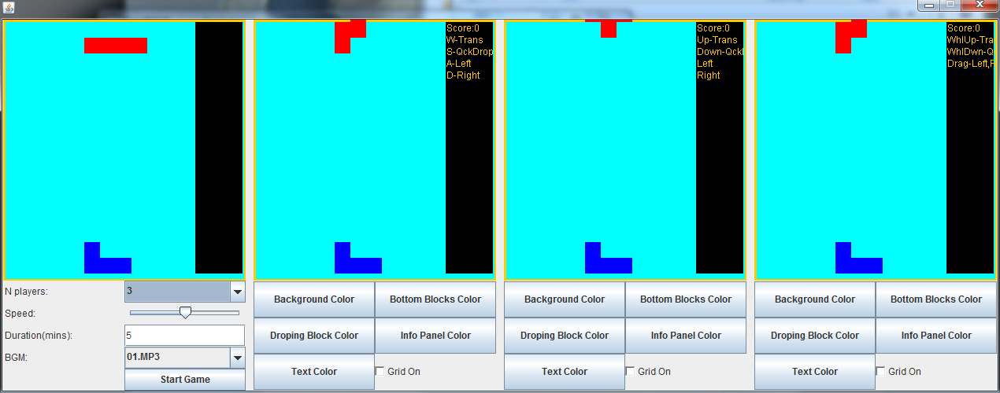
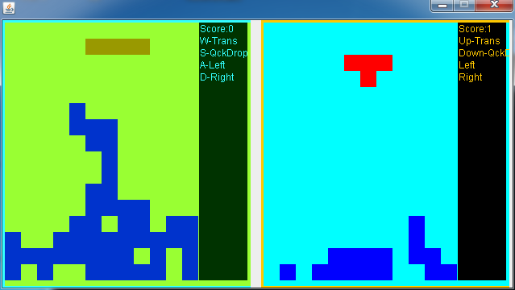

# MultiplayerTetris
A local multi-player (up to 3) Tetris based on Java (J2SE, desktop application)  
You may customize the background color, blocks color, BGM, etc.

# Prerequisites  
Java 6 or newer  
Media Player (e.g. jmf)  

# Development kit  
Eclipse  
JDK 6 or newer

# Run  
1. Compile all .java files  
2. run TetrisMainFrame: `java TetrisMainFrame`  

# Screenshots  

